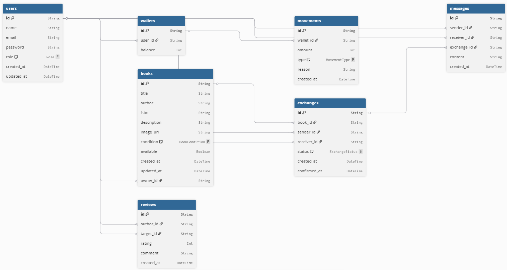

# 📚 Bookloop Backend

Este es el backend de **Bookloop**, una plataforma para gestionar libros, lecturas y recomendaciones. Está construido con [NestJS](https://nestjs.com/) y preparado para escalar 🚀.

---

## 🛠️ Tecnologías

- **NestJS** – Framework para Node.js con arquitectura modular
- **TypeScript** – Tipado fuerte para mayor seguridad
- **CORS habilitado** – Comunicación fluida con el frontend en Next.js
- **REST API** – Endpoints para interactuar con el sistema
- *(Opcional)* Prisma, JWT, Swagger, etc. según tu stack

---

## 🚀 Inicio rápido

```bash
# Instalar dependencias
npm install

# Ejecutar en desarrollo
npm run start:dev

# Acceder a la API
http://localhost:3000
```

📦 Endpoints básicos
```bash
GET /           → Verifica que el backend está corriendo
```
Más endpoints estarán disponibles a medida que se agreguen módulos.

## 🌐 CORS
El backend permite peticiones desde el frontend en Next.js:

```bash
app.enableCors({
  origin: 'http://localhost:3000',
  credentials: true,
});
```

## 📁 Estructura del proyecto
```bash
src/
├── app.controller.ts
├── app.service.ts
├── main.ts
└── app.module.ts
```

## 🧪 Testing
```bash
npm run test
```

## 📌 Variables de entorno
Crea un archivo .env con tus configuraciones:
```bash
PORT=3000
```

## 🗄️Base de datos - Diagrama ER


## 🤝 Contribuir
1. Haz un fork del repositorio

2. Crea una rama con tu feature: git checkout -b feature/nombre

3. Haz commit de tus cambios: git commit -m 'Agrega nueva funcionalidad'

4. Push a tu rama: git push origin feature/nombre

5. Abre un Pull Request

--- 
## 📜 Licencia Este proyecto está bajo la licencia MIT. Consulta el archivo `LICENSE` para más detalles. 
--- 
## 👩🏻‍💻 Autora Desarrollado por **Angela** 
🔗 [GitHub](https://github.com/Angela-GM) 💼 [LinkedIn](https://www.linkedin.com/in/angela-garcia-mu) 🌐 [Portfolio](#)
